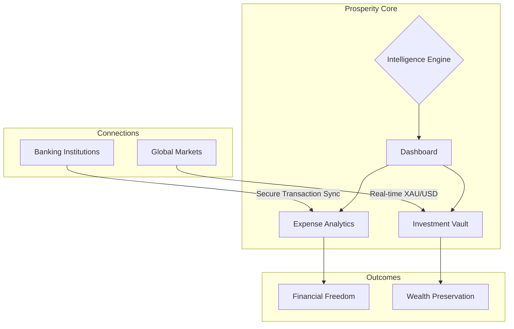

# Prosperity Planner 💎

> **Redefine Your Financial Future with Intelligent Design and Precision Wealth Tracking.**

Prosperity is not just an app; it's your personal financial architect. Designed for those who demand clarity, privacy, and aesthetic excellence, Prosperity transforms the way you interact with your capital.

---

## 🌐 The Wealth Ecosystem

Understanding where your money flows is the first step toward abundance. Prosperity maps your entire financial life into a single, cohesive dashboard.

---

## ✨ Core Pillars

### 📊 Sophisticated Analytics
Go beyond simple tables. Experience your spending through beautiful, high-fidelity visualizations. See where every cent goes with intelligent categorization and merchant-specific branding.

### 🏆 Investment Mastery
Track your gold and precious metal reserves with real-time market data. Our **Investment Vault** monitors global price fluctuations (XAU/USD) and instantly calculates your portfolio's performance across daily, weekly, and yearly horizons.

### 🚀 Velocity & Momentum
Track the speed of your wealth creation. Prosperity calculates your financial **Velocity** (daily growth) and **Momentum** (long-term average) to give you a clear pulse on your economic trajectory.

### 🎯 Milestone Engineering
Set and smash your financial goals. Our automated milestone tracker guides you toward your next net worth target, turning the abstract idea of "saving" into a gamified quest for abundance.

### 🛡️ Privacy by Design
Your financial data is yours alone. Prosperity is built with a security-first philosophy, ensuring your sensitive account information and balances are synchronized through private, military-grade cloud infrastructure.

### 🎨 Premium Experience
A world-class UI that feels alive. With deep support for dark mode, glassmorphic elements, and fluid micro-animations, managing your wealth becomes a moment of zen rather than a chore.

---

## 🚀 Experience Excellence

Prosperity integrates seamlessly with your lifestyle:

- **Live Market Sync**: Real-time asset valuation.
- **Liability Management**: Monitor credit cards and debts in one view.
- **Liquid Asset Tracking**: Real-time updates on your accessible capital.
- **Recurring Intelligence**: Never be surprised by a subscription or bill again.

---

## 💎 The Vision

Our mission is to empower individuals with the tools usually reserved for elite wealth managers. Prosperity brings clarity to complexity, allowing you to focus on what truly matters: **building your legacy.**

---

*© 2026 Prosperity Collective. All rights reserved.*
